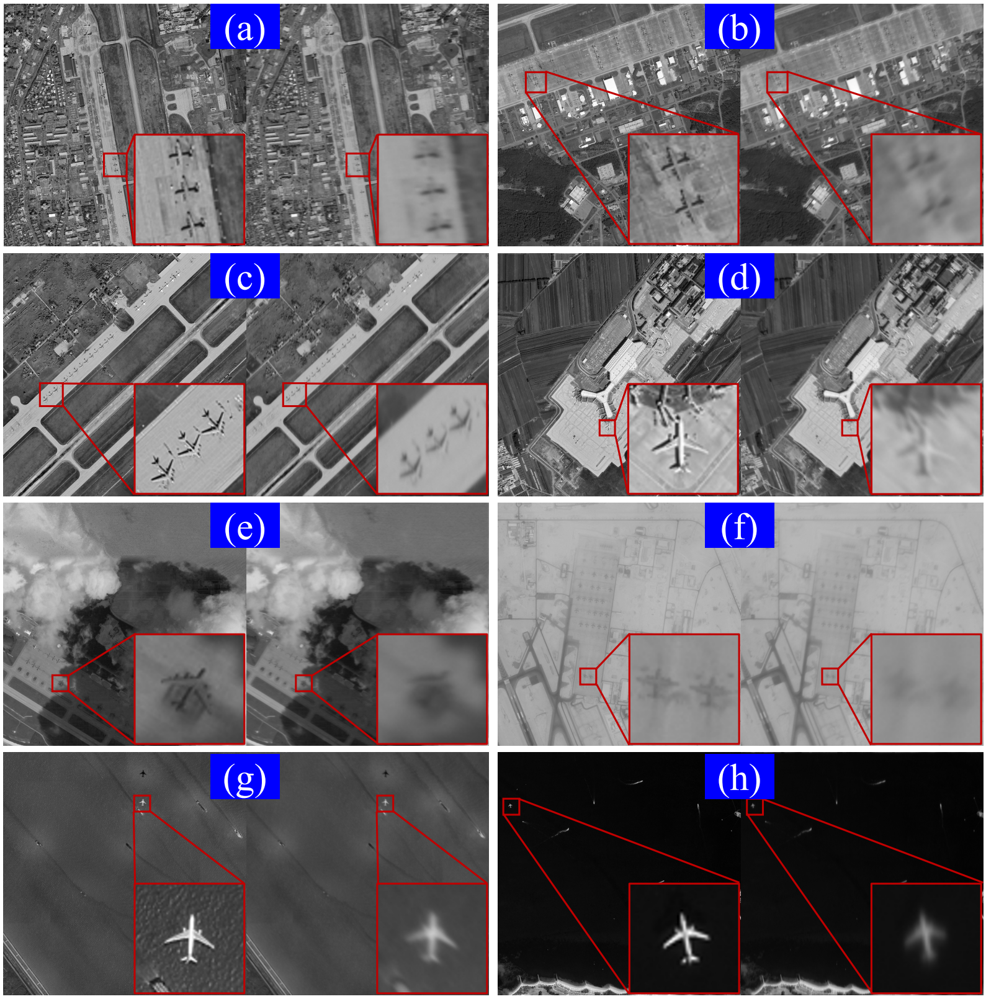
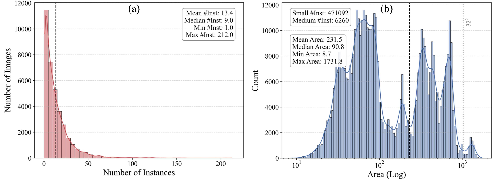

# RSA-Aircraft: A Benchmark Dataset for Object Detection with Anisotropic Degradation

**RSA-Aircraft** is a large-scale benchmark dataset for aircraft object detection in **Rotating Synthetic Aperture (RSA)** imagery. It is designed for studying robust oriented object detection under **RSA-specific anisotropic degradation**, where aircraft contours, textures, and target-background contrast are directionally degraded by the rotating rectangular aperture.

<p align="center">
  
</p>

<p align="center">
  <em>Representative samples from RSA-Aircraft. The undegraded images shown in the paper figure are for visual comparison only and are not included in this public release.</em>
</p>

---

## Release Scope

This repository publicly releases the **simulated degraded images and oriented bounding-box annotations** used in Section 4.1 of our paper.

**Released:**

* Simulated RSA-degraded aircraft images
* DOTA-style oriented bounding-box labels
* Official train/test split

**Not released:**

* Original undegraded images
* Clear/reference images for restoration
* Raw source imagery
* Semi-physical experimental data

---

## Highlights

* **First benchmark for RSA aircraft detection**
  RSA-Aircraft focuses on object detection under anisotropic degradation introduced by Rotating Synthetic Aperture imaging.

* **Physically motivated degradation**
  The degraded images are generated using a full-link remote-sensing imaging simulation model, including RSA-specific anisotropic PSF degradation.

* **Large-scale and dense annotations**
  The dataset contains **35,704 degraded images** and **477,352 aircraft instances**, with dense target distributions and many small aircraft.

* **Diverse global airport scenes**
  The source scenes cover military and civilian airports from over 100 countries and regions, with different backgrounds, seasons, years, and weather conditions.

* **Standard oriented detection format**
  All labels follow the DOTA-style oriented bounding-box format, making the dataset compatible with common remote-sensing detection toolboxes such as MMRotate.

---

## Dataset Statistics

| Item                | Description                                  |
| ------------------- | -------------------------------------------- |
| Dataset name        | RSA-Aircraft                                 |
| Task                | Oriented aircraft object detection           |
| Image type          | Simulated RSA-degraded remote-sensing images |
| Number of images    | 35,704                                       |
| Image size          | 1024 × 1024 pixels                           |
| Number of instances | 477,352                                      |
| Annotation type     | Oriented Bounding Boxes, OBBs                |
| Annotation format   | DOTA-style label format                      |
| Spatial resolution  | Approximately 1.5–3.0 m                      |
| Training set        | 28,620 images                                |
| Test set            | 7,084 images                                 |
| Split strategy      | Non-overlapping geographical locations       |
| Public release      | Degraded images and detection labels only    |

<p align="center">
  
</p>

<p align="center">
  <em>Statistical analysis of RSA-Aircraft, including instance density distribution and object area distribution.</em>
</p>

RSA-Aircraft is challenging because it contains dense aircraft distributions and is dominated by small objects. In RSA imagery, anisotropic blur further weakens the already limited effective features of small aircraft, making reliable detection more difficult than in standard optical remote-sensing images.

---

## Dataset Organization

Each annotation file follows the DOTA-style format:

```text
x1 y1 x2 y2 x3 y3 x4 y4 class_name difficult
```

where `(x1, y1), ..., (x4, y4)` denote the four vertices of the oriented bounding box.

Please use the official train/test split for fair comparison. The split is performed at the level of original large airport scenes before patch cropping: the airport-scale large images used for testing do not appear in the training set. After the split, each large image is cropped into 1024 × 1024 patches with a certain overlap to preserve complete aircraft targets near patch boundaries. Therefore, overlap may exist among cropped patches from the same large image, but no original large airport scene is shared between the training and test sets.

---

## Download

The dataset is available for academic research only.

* Baidu Netdisk: coming soon
* Google Drive: coming soon

---

## Usage License

RSA-Aircraft is released for **non-commercial academic research only**.

By downloading or using this dataset, you agree to the following terms:

1. The dataset may only be used for academic research.
2. Commercial use is prohibited.
3. The dataset may not be redistributed, sold, or used in commercial products or services.
4. If you use RSA-Aircraft in your research, please cite our paper.
5. The public release only contains simulated degraded images and detection annotations. The undegraded images, restoration ground truth, raw source imagery, and semi-physical experimental data are not included.

---

## Citation

If you use RSA-Aircraft in your research, please cite:

```bibtex
@article{shi2026dace,
  title={DACE-Det: a synergistic fusion framework of multi-task streams for object detection in anisotropically degraded imagery},
  author={Shi, Tianjun and Gong, Jinnan and Jiang, Shikai and Sun, Yu and Bao, Guangzhen and Zhang, Pengfei and Lu, Hongyu and Zhi, Xiyang and Zhang, Wei},
  journal={Information Fusion},
  volume={134},
  pages={104382},
  year={2026},
  doi={10.1016/j.inffus.2026.104382}
}
```

---

## Contact

For questions or feedback, please contact:

**Tianjun Shi**
Research Center for Space Optical Engineering, Harbin Institute of Technology
Email: [shitianjun@stu.hit.edu.cn](mailto:shitianjun@stu.hit.edu.cn)
